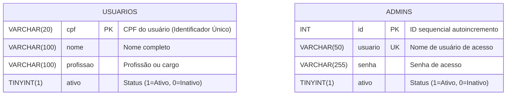

# Projeto DBA CC26 — Sistema de Controle e Consulta de Usuários

Sistema web completo para controle e gerenciamento de usuários com autenticação administrativa, desenvolvido em Python puro (sem frameworks), MySQL nativo e interface web (HTML5/CSS3/JavaScript).

---

## 1. Descrição do Projeto

### Apresentação do Tema
O **Sistema de Controle e Consulta de Usuários** é uma aplicação corporativa voltada ao gerenciamento seguro e centralizado de cadastros de pessoas e permissões de acesso administrativo.

### Arquitetura e Tecnologias
- **Backend**: Python 3.8+ utilizando apenas bibliotecas nativas (`http.server`, `json`, `re`, `urllib`) e o driver oficial `mysql-connector-python`.
- **Banco de Dados**: MySQL Server 8.0+ com engine InnoDB e charset `utf8mb4`.
- **Frontend**: Interface web moderna desenvolvida em HTML5, CSS3 estilizado e JavaScript puro (ES6+ Vanilla).

### Regras de Negócio e Funcionalidades
- **Identificação Única**: Cada usuário é identificado unicamente pelo seu **CPF** (Chave Primária da tabela `usuarios`).
- **Validação Algorítmica de CPF**: Verificação de quantidade de dígitos (11 dígitos), sequências repetidas e formato numérico.
- **Máscara Automática de CPF**: Formatação dinâmica em tempo real (`XXX.XXX.XXX-XX`) à medida que o usuário digita nos campos de formulário.
- **Busca e Comparação Flexível**: O sistema permite consultar, atualizar e inativar registros tanto digitando o CPF com pontuação (`123.456.789-01`) quanto apenas números (`12345678901`), além de busca parcial por Nome.
- **Inativação Lógica (*Soft Delete*)**: O sistema não exclui fisicamente os registros de usuários da base de dados. Em vez disso, altera o status `ativo` para `0` (Inativo).
- **Filtro de Exibição**: Todas as consultas e listagens no sistema exibem estritamente registros de usuários ativos (`ativo = 1`).
- **Reativação de Cadastros**: Ao tentar cadastrar ou consultar um CPF inativo, o sistema detecta o registro e oferece opção de reativação com atualização automática de dados (Nome e Profissão).
- **Edição em Duas Etapas**: Para atualizar o cadastro, o operador informa o CPF do usuário desejado. O sistema busca e carrega automaticamente os dados atuais para edição e posterior confirmação.
- **Telas Dedicadas**: Separação clara de fluxos em páginas exclusivas (`adicionar.html`, `atualizar.html`, `deletar.html`, `consulta.html`, `resultados.html`).
- **Autenticação Administrativa**: O acesso ao painel de gerenciamento exige autenticação prévia de usuário administrador na tabela `admins`.

---

## 2. Estrutura do Projeto

```text
projeto_dba_cc26/
├── ConsultaUsuarios/              # Arquivos de Frontend (HTML/CSS/JS)
│   ├── css/                       # Estilos CSS da aplicação
│   ├── imagem/                    # Recursos de imagem e logotipos
│   ├── js/                        # Scripts JavaScript (máscaras, chamadas API)
│   ├── telas/                     # Páginas HTML dos fluxos
│   │   ├── adicionar.html         # Cadastro de novos usuários
│   │   ├── atualizar.html         # Edição de cadastro existente
│   │   ├── consulta.html          # Busca por Nome ou CPF
│   │   ├── deletar.html           # Inativação de usuários
│   │   ├── editar.html            # Formulário complementar de edição
│   │   └── resultados.html        # Exibição de resultados
│   ├── index.html                 # Tela de Login Administrativo
│   └── favicon.ico                # Ícone da aplicação
├── backend/                       # Servidor Python e Configurações
│   ├── config.py                  # Credenciais do banco e porta do servidor
│   ├── init_db.sql                # Script DDL e cargas iniciais
│   └── servidor.py                # Servidor HTTP nativo e API REST
├── .gitignore                     # Arquivos ignorados pelo Git
└── README.md                      # Documentação do projeto
```

---

## 3. Modelagem de Dados

### Diagrama Entidade-Relacionamento (DER)



### Scripts DDL Completos

```sql
/* =====================================================
   SCRIPT DDL — BANCO E TABELAS DO PROJETO
===================================================== */

CREATE DATABASE IF NOT EXISTS controle_usuarios
    CHARACTER SET utf8mb4
    COLLATE utf8mb4_unicode_ci;

USE controle_usuarios;


-- Tabela de Usuários
CREATE TABLE IF NOT EXISTS usuarios (
    cpf         VARCHAR(20)  NOT NULL PRIMARY KEY,
    nome        VARCHAR(100) NOT NULL,
    profissao   VARCHAR(100) NOT NULL,
    ativo       TINYINT(1)   NOT NULL DEFAULT 1
) ENGINE=InnoDB DEFAULT CHARSET=utf8mb4;


-- Tabela de Administradores
CREATE TABLE IF NOT EXISTS admins (
    id       INT          AUTO_INCREMENT PRIMARY KEY,
    usuario  VARCHAR(50)  NOT NULL UNIQUE,
    senha    VARCHAR(255) NOT NULL,
    ativo    TINYINT(1)   NOT NULL DEFAULT 1
) ENGINE=InnoDB DEFAULT CHARSET=utf8mb4;


-- Dados Iniciais — Usuários
INSERT IGNORE INTO usuarios (cpf, nome, profissao, ativo) VALUES
    ('123.456.789-01', 'João da Silva',           'Analista de Sistemas', 1),
    ('234.567.890-12', 'João Pedro Santos',        'Desenvolvedor', 1),
    ('345.678.901-23', 'João Carlos Oliveira',     'Suporte Técnico', 1),
    ('456.789.012-34', 'João Vitor Almeida',       'Designer Gráfico', 1),
    ('567.890.123-45', 'João Marcelo Souza',       'Assistente Administrativo', 1);


-- Dados Iniciais — Administradores
INSERT IGNORE INTO admins (usuario, senha, ativo) VALUES
    ('admin', '1234', 1);
```

---

## 4. Documentação da API REST

| Método | Endpoint | Descrição | Corpo / Parâmetros |
| :--- | :--- | :--- | :--- |
| `POST` | `/api/login` | Autenticação do administrador | `{ "usuario": "...", "senha": "..." }` |
| `GET` | `/api/usuarios` | Lista usuários ativos ou filtra por nome/CPF | `?busca=...` ou `?nome=...` |
| `GET` | `/api/usuarios/buscar-cpf` | Busca detalhes de um CPF para edição | `?cpf=...` |
| `POST` | `/api/usuarios` | Insere novo usuário ativo | `{ "cpf": "...", "nome": "...", "profissao": "..." }` |
| `PUT` | `/api/usuarios` | Atualiza dados de um usuário ativo | `{ "cpf": "...", "nome": "...", "profissao": "..." }` |
| `POST` | `/api/usuarios/reativar` | Reativa registro inativo e atualiza dados | `{ "cpf": "...", "nome": "...", "profissao": "..." }` |
| `DELETE` | `/api/usuarios` | Realiza *soft delete* (altera `ativo = 0`) | `{ "cpf": "..." }` |

---

## 5. Guia de Instalação e Execução

### Pré-requisitos
- **Python 3.8+** instalado.
- **MySQL Server 8.0+** em execução local na porta `3306`.

### Passo 1: Clonar o Repositório
```bash
git clone https://github.com/BatistaSec/projeto_dba_cc26.git
cd projeto_dba_cc26
```

### Passo 2: Instalar Dependências Python
Instale a biblioteca de conexão do MySQL:
```bash
pip install mysql-connector-python
```

### Passo 3: Configurar Credenciais do MySQL
Abra o arquivo `backend/config.py` e configure as credenciais do seu ambiente MySQL:
```python
DB_CONFIG = {
    "host":     "localhost",
    "user":     "root",
    "password": "SuaSenhaDoMySQL",  # <-- Altere para a sua senha
    "database": "controle_usuarios",
    "charset":  "utf8mb4",
}

PORTA_SERVIDOR = 8080
```

### Passo 4: Inicializar o Banco de Dados
Execute o script DDL no MySQL para criar o banco de dados `controle_usuarios` e popular os dados iniciais:
```bash
mysql -u root -p < backend/init_db.sql
```
*(Também é possível executar o conteúdo de `backend/init_db.sql` via MySQL Workbench, DBeaver ou phpMyAdmin).*

### Passo 5: Executar o Servidor Python
Inicie o servidor HTTP nativo:
```bash
python backend/servidor.py
```

### Passo 6: Acessar a Interface Web
Abra o navegador de sua preferência e acesse:
```text
http://localhost:8080
```

- **Usuário Admin Padrão**: `admin`
- **Senha**: `1234`

