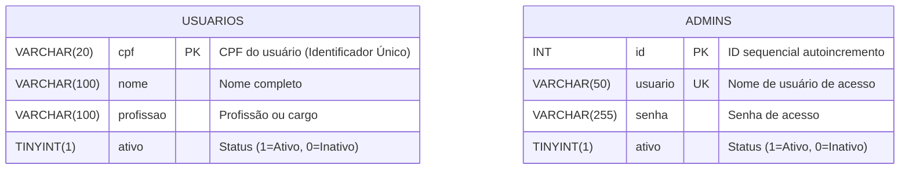

# Projeto DBA CC26 — Sistema de Controle e Consulta de Usuários

Sistema web completo para controle e gerenciamento de usuários com autenticação administrativa, desenvolvido em Python puro (sem frameworks), MySQL nativo e interface web (HTML5/CSS3/JavaScript).

---

## 1. Descrição do Projeto

### Apresentação do Tema
O **Sistema de Controle e Consulta de Usuários** é uma aplicação corporativa voltada ao gerenciamento seguro e centralizado de cadastros de pessoas e permissões de acesso administrativo.

### Regras de Negócio
- **Identificação Única**: Cada usuário é identificado unicamente pelo seu **CPF** (Chave Primária da tabela `usuarios`).
- **Máscara Automática de CPF**: Formatação dinâmica em tempo real (`XXX.XXX.XXX-XX`) à medida que o usuário digita nos campos de formulário.
- **Busca e Comparação Flexível**: O sistema permite consultar, atualizar e inativar registros tanto digitando o CPF com pontuação (`123.456.789-01`) quanto apenas números (`12345678901`).
- **Inativação Lógica (*Soft Delete*)**: O sistema não exclui fisicamente os registros de usuários da base de dados ao remover um cadastro. Em vez disso, altera o status `ativo` para `0` (Inativo).
- **Filtro de Exibição**: Todas as consultas e listagens no sistema exibem estritamente registros de usuários ativos (`ativo = 1`).
- **Reativação Automática**: Ao cadastrar um CPF que já foi inativado no passado, o sistema atualiza seus dados (Nome e Profissão) e reativa o registro (`ativo = 1`).
- **Edição em Duas Etapas**: Para atualizar o cadastro, o operador informa o CPF do usuário desejado. O sistema busca e carrega automaticamente os dados atuais (Nome e Profissão) para edição e posterior confirmação.
- **Telas Dedicadas**: Separação clara de fluxos em páginas exclusivas (`adicionar.html`, `atualizar.html`, `deletar.html`).
- **Autenticação Administrativa**: O acesso ao painel de gerenciamento exige autenticação prévia de usuário administrador na tabela `admins`.

### Escopo Funcional
- **Login Administrativo**: Validação de credenciais de administradores ativos no MySQL.
- **Consulta de Usuários**: Busca textual flexível por Nome **OU** por CPF com exibição tabular de CPF, Nome e Profissão.
- **Inclusão de Usuários**: Formulário para inserção de novos usuários ativos com validação de formato de CPF.
- **Atualização de Usuários**: Consulta prévia por CPF (carregando Nome e Profissão) e alteração dos dados cadastrais.
- **Exclusão Lógica de Usuários**: Inativação por CPF com mensagem clara de confirmação em verde.
- **Botão Sair**: Encerramento seguro de sessão e retorno à tela de login inicial.

---

## 2. Modelagem de Dados

### Diagrama Entidade-Relacionamento (DER)



### Scripts DDL Completos

```sql
/* =====================================================
   SCRIPT DDL — BANCO E TABELAS DO PROJETO
===================================================== */

CREATE DATABASE IF NOT EXISTS controle_usuarios
    CHARACTER SET utf8mb4
    COLLATE utf8mb4_unicode_ci;

USE controle_usuarios;


-- Tabela de Usuários
CREATE TABLE IF NOT EXISTS usuarios (
    cpf         VARCHAR(20)  NOT NULL PRIMARY KEY,
    nome        VARCHAR(100) NOT NULL,
    profissao   VARCHAR(100) NOT NULL,
    ativo       TINYINT(1)   NOT NULL DEFAULT 1
) ENGINE=InnoDB DEFAULT CHARSET=utf8mb4;


-- Tabela de Administradores
CREATE TABLE IF NOT EXISTS admins (
    id       INT          AUTO_INCREMENT PRIMARY KEY,
    usuario  VARCHAR(50)  NOT NULL UNIQUE,
    senha    VARCHAR(255) NOT NULL,
    ativo    TINYINT(1)   NOT NULL DEFAULT 1
) ENGINE=InnoDB DEFAULT CHARSET=utf8mb4;


-- Dados Iniciais — Usuários
INSERT IGNORE INTO usuarios (cpf, nome, profissao, ativo) VALUES
    ('123.456.789-01', 'João da Silva',           'Analista de Sistemas', 1),
    ('234.567.890-12', 'João Pedro Santos',        'Desenvolvedor', 1),
    ('345.678.901-23', 'João Carlos Oliveira',     'Suporte Técnico', 1),
    ('456.789.012-34', 'João Vitor Almeida',       'Designer Gráfico', 1),
    ('567.890.123-45', 'João Marcelo Souza',       'Assistente Administrativo', 1);


-- Dados Iniciais — Administradores
INSERT IGNORE INTO admins (usuario, senha, ativo) VALUES
    ('admin', '1234', 1);
```

---

## 3. Guia de Instalação e Execução

### Pré-requisitos
- **Python 3.8+** instalado.
- **MySQL Server 8.0+** em execução local na porta `3306`.

### Passo 1: Clonar o Repositório Limpo
```bash
git clone https://github.com/BatistaSec/projeto_dba_cc26.git
cd projeto_dba_cc26
```

### Passo 2: Instalar Dependências Python
Instale a biblioteca `mysql-connector-python`:
```bash
pip install mysql-connector-python
```

### Passo 3: Configurar Credenciais do MySQL
Abra o arquivo `backend/config.py` e insira a senha do seu usuário `root` do MySQL:
```python
DB_CONFIG = {
    "host":     "localhost",
    "user":     "root",
    "password": "SuaSenhaDoMySQL",  # <-- Altere para a sua senha
    "database": "controle_usuarios",
    "charset":  "utf8mb4",
}
```

### Passo 4: Inicializar o Banco de Dados
Execute o script DDL no MySQL para criar o banco de dados `controle_usuarios` e popular as tabelas:
```bash
mysql -u root -p < backend/init_db.sql
```
*(Também é possível executar o conteúdo de `backend/init_db.sql` via MySQL Workbench, DBeaver ou phpMyAdmin).*

### Passo 5: Executar o Servidor Python
Inicie o servidor HTTP nativo:
```bash
python backend/servidor.py
```

### Passo 6: Acessar a Interface Web
Abra o navegador de sua preferência e acesse:
```text
http://localhost:8080
```

- **Usuário Admin Padrão**: `admin`
- **Senha**: `1234`
