# Projeto DBA CC26 — Sistema de Controle e Gestão de EPIs

Sistema web completo para controle de estoque, fornecimento e rastreio de Equipamentos de Proteção Individual (EPIs) para colaboradores, desenvolvido em Python puro (sem frameworks), MySQL nativo e interface web (HTML5/CSS3/JavaScript).

---

## 1. Identificação Institucional e Integrantes

* **Instituição:** Universidade Paulista (UNIP)
* **Curso:** Bacharelado em Ciência da Computação
* **Disciplina:** Banco de Dados (NP1)
* **Semestre:** 3º Semestre / 4º Semestre 
* **Ano:** 2026
* **Integrantes do Grupo:**
  * Flávio Augusto Rodrigues de Oliveira - R950239
  * Henry Vinícius Barros Salgado - H789IG0
  * Joao Batista Suzana Filho - R956IH4
  * Lucas Marçal de Oliveira - R879941
  * Matheus Henrique Aparecido Cardoso - H77IFE3

---

## 2. Descrição do Projeto

### Apresentação do Tema
O **Sistema de Controle de EPIs** é uma aplicação corporativa e industrial destinada a gerenciar o cadastro de funcionários, o inventário de Equipamentos de Proteção Individual e o registro detalhado de retiradas e devoluções, visando conformidade com as normas de segurança do trabalho.

### Arquitetura e Tecnologias
- **Backend**: Python 3.8+ utilizando apenas bibliotecas nativas (`http.server`, `json`, `re`, `urllib`) e suporte a múltiplos drivers (`mysql-connector-python`, `sqlite3`, `pyodbc`).
- **Banco de Dados**: Suporte nativo e configurável para MySQL Server 8.0+, Microsoft SQL Server ou SQLite via variável de ambiente.
- **Frontend**: Interface web desenvolvida em HTML5, CSS3 estilizado e JavaScript puro (ES6+ Vanilla).

### Regras de Negócio e Funcionalidades
- **Normalização e Integridade Referencial**: Mapeamento completo de profissões (`profissoes`) e setores (`setores`), garantindo que cada funcionário pertença a entidades válidas via chaves estrangeiras.
- **Identificação e Busca Híbrida (CPF ou Matrícula)**: Todas as pesquisas, consultas, atualização, inativação/deletar, retiradas e devoluções aceitam o **CPF** (com ou sem formatação `xxx.xxx.xxx-xx`) ou a **Matrícula** (ex: `FUNC-001`).
- **Auto-complete Inteligente de Matrícula**: Nos campos de busca e cadastro, digitar `func` ou `FUNC` completa automaticamente com o hífen e prefixo `FUNC-` facilitando a digitação rápida.
- **Entrada Flexível de Profissão vs. Seleção de Setor**: O setor é selecionado via opções predefinidas (`setores`), enquanto a profissão pode ser digitada livremente pelo usuário na interface e o sistema cadastra/associa automaticamente na tabela `profissoes` gerando uma descrição padronizada da categoria.
- **Rastreabilidade e Formatação de Funcionários**: Cadastro de colaboradores associando matrícula (única), CPF, e-mail, telefone, setor e profissão. Caso a matrícula não seja informada no cadastro, o sistema gera automaticamente no padrão `FUNC-xxx`.
- **Gestão de Estoque de EPIs**: Controle rigoroso de estoque atual e ponto de reposição (`estoque_minimo`), contendo obrigatoriamente código do item, Certificado de Aprovação (CA), tamanho e sinalização visual de estoque baixo (`BAIXO`/`OK`).
- **Movimentação e Devolução de EPIs**: Mapeamento do fluxo de entrega e devolução parcial ou total de equipamentos aos colaboradores, atualizando o saldo do estoque e registrando datas e status.
- **Inativação Lógica (*Soft Delete*)**: O sistema utiliza o atributo `ativo` (`1` para ativo e `0` para inativo) para desativar/inativar funcionários no banco preservando todo o histórico de retiradas e devoluções.
- **Autenticação Administrativa**: O acesso ao painel de gerenciamento exige autenticação prévia de usuário administrador na tabela `admins`.

---

## 3. Estrutura do Projeto

```text
projeto_dba_cc26/
├── ConsultaFuncionarios/          # Arquivos de Frontend (HTML/CSS/JS)
│   ├── css/                       # Estilos CSS da aplicação
│   ├── imagem/                    # Recursos de imagem e logotipos
│   ├── js/                        # Scripts JavaScript (máscaras, chamadas API)
│   ├── telas/                     # Páginas HTML dos fluxos
│   └── index.html                 # Tela de Login Administrativo
├── backend/                       # Servidor Python e Configurações (MVC)
│   ├── controllers/               # Controladores da API (Lógica de Negócio)
│   │   ├── auth_controller.py
│   │   ├── epi_controller.py
│   │   ├── funcionario_controller.py
│   │   └── movimentacao_controller.py
│   ├── config.py                  # Fábrica de conexões multi-DB (MySQL, SQL Server, SQLite)
│   ├── database.py                # Wrapper para execução de consultas no DB
│   ├── utils.py                   # Funções auxiliares (CPF, MIME types)
│   ├── init_db.sql                # Script DDL e cargas iniciais do banco
│   └── servidor.py                # Ponto de entrada: Servidor HTTP e Roteador de Requests
├── docs/                          # Documentações e Prints de Evidência
│   └── prints/                    # Prints de tela para o README
├── .gitignore                     # Arquivos ignorados pelo Git
└── README.md                      # Documentação do projeto
```

---

## 4. Modelagem de Dados

### Diagrama Entidade-Relacionamento (DER)

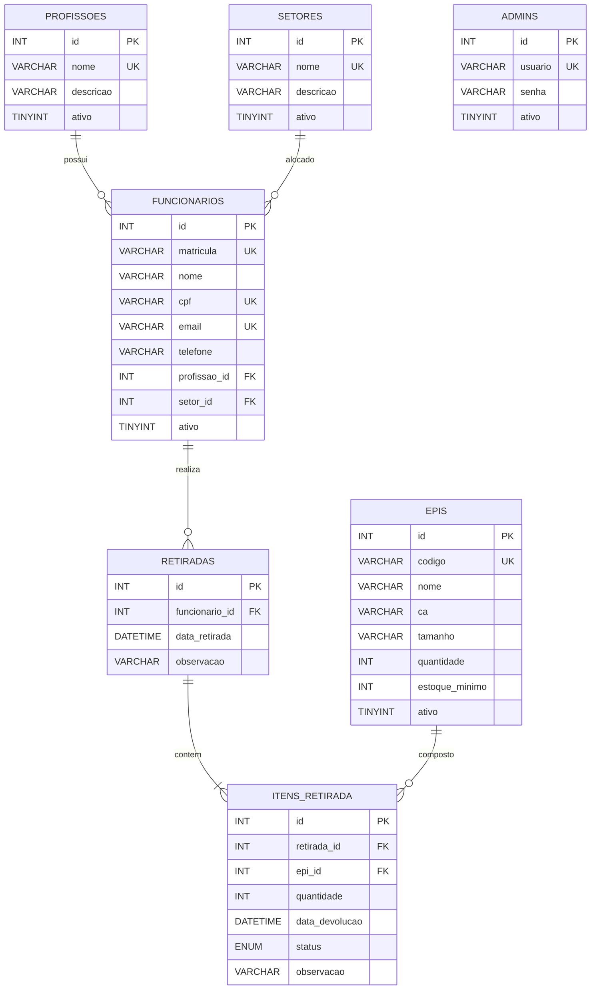

### Script DDL e DML Completo

```sql
/* =====================================================
   SCRIPT DDL/DML — BANCO DE DADOS CONTROLE DE EPIS
   Disciplina: Banco de Dados (NP1) - UNIP CC26
===================================================== */

CREATE DATABASE IF NOT EXISTS controle_usuarios
    CHARACTER SET utf8mb4
    COLLATE utf8mb4_unicode_ci;

USE controle_usuarios;

/* =====================================================
   1. TABELA DE PROFISSÕES
===================================================== */
CREATE TABLE IF NOT EXISTS profissoes (
    id INT AUTO_INCREMENT PRIMARY KEY,
    nome VARCHAR(100) NOT NULL UNIQUE,
    descricao VARCHAR(255),
    ativo TINYINT(1) NOT NULL DEFAULT 1
) ENGINE=InnoDB DEFAULT CHARSET=utf8mb4;

/* =====================================================
   2. TABELA DE SETORES
===================================================== */
CREATE TABLE IF NOT EXISTS setores (
    id INT AUTO_INCREMENT PRIMARY KEY,
    nome VARCHAR(100) NOT NULL UNIQUE,
    descricao VARCHAR(255),
    ativo TINYINT(1) NOT NULL DEFAULT 1
) ENGINE=InnoDB DEFAULT CHARSET=utf8mb4;

/* =====================================================
   3. TABELA DE FUNCIONÁRIOS
===================================================== */
CREATE TABLE IF NOT EXISTS funcionarios (
    id INT AUTO_INCREMENT PRIMARY KEY,
    matricula VARCHAR(30) NOT NULL UNIQUE,
    nome VARCHAR(100) NOT NULL,
    cpf VARCHAR(20) NOT NULL UNIQUE,
    email VARCHAR(150) NOT NULL UNIQUE,
    telefone VARCHAR(20),
    profissao_id INT NOT NULL,
    setor_id INT NOT NULL,
    ativo TINYINT(1) NOT NULL DEFAULT 1,

    INDEX idx_funcionario_nome (nome),

    CONSTRAINT fk_funcionarios_profissao
        FOREIGN KEY (profissao_id)
        REFERENCES profissoes(id)
        ON DELETE RESTRICT ON UPDATE CASCADE,

    CONSTRAINT fk_funcionario_setor
        FOREIGN KEY (setor_id)
        REFERENCES setores(id)
        ON DELETE RESTRICT ON UPDATE CASCADE
) ENGINE=InnoDB DEFAULT CHARSET=utf8mb4;

/* =====================================================
   4. TABELA DE EPIs
===================================================== */
CREATE TABLE IF NOT EXISTS epis (
    id INT AUTO_INCREMENT PRIMARY KEY,
    codigo VARCHAR(30) NOT NULL UNIQUE,
    nome VARCHAR(100) NOT NULL,
    descricao VARCHAR(255),
    ca VARCHAR(50) NOT NULL,
    tamanho VARCHAR(20),
    quantidade INT NOT NULL DEFAULT 0,
    estoque_minimo INT NOT NULL DEFAULT 0,
    ativo TINYINT(1) NOT NULL DEFAULT 1,

    INDEX idx_epi_nome (nome)

) ENGINE=InnoDB DEFAULT CHARSET=utf8mb4;

/* =====================================================
   5. TABELA DE RETIRADAS
===================================================== */
CREATE TABLE IF NOT EXISTS retiradas (
    id INT AUTO_INCREMENT PRIMARY KEY,
    funcionario_id INT NOT NULL,
    data_retirada DATETIME NOT NULL DEFAULT CURRENT_TIMESTAMP,
    observacao VARCHAR(255),

    CONSTRAINT fk_retirada_funcionario
        FOREIGN KEY (funcionario_id)
        REFERENCES funcionarios(id)
        ON DELETE RESTRICT ON UPDATE CASCADE
) ENGINE=InnoDB DEFAULT CHARSET=utf8mb4;

/* =====================================================
   6. TABELA DE ITENS DA RETIRADA
===================================================== */
CREATE TABLE IF NOT EXISTS itens_retirada (
    id INT AUTO_INCREMENT PRIMARY KEY,
    retirada_id INT NOT NULL,
    epi_id INT NOT NULL,
    quantidade INT NOT NULL DEFAULT 1,
    data_devolucao DATETIME,
    status ENUM('RETIRADO', 'DEVOLVIDO', 'ATRASADO') NOT NULL DEFAULT 'RETIRADO',
    observacao VARCHAR(255),

    INDEX idx_item_status (status),

    CONSTRAINT fk_item_retirada
        FOREIGN KEY (retirada_id)
        REFERENCES retiradas(id)
        ON DELETE CASCADE ON UPDATE CASCADE,

    CONSTRAINT fk_item_epi
        FOREIGN KEY (epi_id)
        REFERENCES epis(id)
        ON DELETE RESTRICT ON UPDATE CASCADE
) ENGINE=InnoDB DEFAULT CHARSET=utf8mb4;

/* =====================================================
   7. TABELA DE ADMINISTRADORES
===================================================== */
CREATE TABLE IF NOT EXISTS admins (
    id INT AUTO_INCREMENT PRIMARY KEY,
    usuario VARCHAR(50) NOT NULL UNIQUE,
    senha VARCHAR(255) NOT NULL,
    ativo TINYINT(1) NOT NULL DEFAULT 1
) ENGINE=InnoDB DEFAULT CHARSET=utf8mb4;

/* =====================================================
   CARGA INICIAL DE DADOS (DML)
===================================================== */

INSERT INTO profissoes (nome, descricao) VALUES
    ('Operador de Produção', 'Responsável por atividades relacionadas à produção'),
    ('Técnico de Segurança', 'Responsável pelas atividades de segurança do trabalho'),
    ('Almoxarife', 'Responsável pelo controle e armazenamento de materiais'),
    ('Supervisor de Produção', 'Responsável pela supervisão das atividades de produção'),
    ('Técnico de Manutenção', 'Responsável pela manutenção de máquinas e equipamentos');

INSERT INTO setores (nome, descricao) VALUES
    ('Produção', 'Setor responsável pela produção'),
    ('Almoxarifado', 'Setor responsável pelo armazenamento e controle de estoque'),
    ('Manutenção', 'Setor responsável pela manutenção de equipamentos'),
    ('Qualidade', 'Setor responsável pelo controle de qualidade'),
    ('Segurança do Trabalho', 'Setor responsável pela segurança dos funcionários');

INSERT INTO funcionarios
    (matricula, nome, cpf, email, telefone, profissao_id, setor_id)
VALUES
    (
        'FUNC-001',
        'João da Silva',
        '123.456.789-01',
        'joao.silva@email.com',
        '(11) 99999-0001',
        (SELECT id FROM profissoes
         WHERE nome = 'Operador de Produção'),
        (SELECT id FROM setores
         WHERE nome = 'Produção')
    ),
    (
        'FUNC-002',
        'Pedro Santos',
        '234.567.890-12',
        'pedro.santos@email.com',
        '(11) 99999-0002',
        (SELECT id FROM profissoes
         WHERE nome = 'Técnico de Segurança'),
        (SELECT id FROM setores
         WHERE nome = 'Segurança do Trabalho')
    ),
    (
        'FUNC-003',
        'Carlos Oliveira',
        '345.678.901-23',
        'carlos.oliveira@email.com',
        '(11) 99999-0003',
        (SELECT id FROM profissoes
         WHERE nome = 'Almoxarife'),
        (SELECT id FROM setores
         WHERE nome = 'Almoxarifado')
    ),
    (
        'FUNC-004',
        'Marcos Almeida',
        '456.789.012-34',
        'marcos.almeida@email.com',
        '(11) 99999-0004',
        (SELECT id FROM profissoes
         WHERE nome = 'Supervisor de Produção'),
        (SELECT id FROM setores
         WHERE nome = 'Produção')
    ),
    (
        'FUNC-005',
        'Lucas Souza',
        '567.890.123-45',
        'lucas.souza@email.com',
        '(11) 99999-0005',
        (SELECT id FROM profissoes
         WHERE nome = 'Técnico de Manutenção'),
        (SELECT id FROM setores
         WHERE nome = 'Manutenção')
    );

INSERT INTO epis
    (codigo, nome, descricao, ca, tamanho, quantidade, estoque_minimo)
VALUES
    ('EPI-001', 'Capacete de Segurança',
     'Capacete para proteção da cabeça', '12345', 'Único', 20, 5),

    ('EPI-002', 'Óculos de Proteção',
     'Óculos para proteção dos olhos', '23456', 'Único', 30, 10),

    ('EPI-003', 'Luva de Proteção',
     'Luva para proteção das mãos', '34567', 'M', 50, 10),

    ('EPI-004', 'Botina de Segurança',
     'Botina para proteção dos pés', '45678', '40', 15, 5),

    ('EPI-005', 'Protetor Auricular',
     'Proteção contra ruídos', '56789', 'Único', 25, 5),

    ('EPI-006', 'Máscara Respiratória',
     'Proteção respiratória contra partículas', '67890', 'Único', 40, 10);

INSERT INTO admins (usuario, senha) VALUES
    ('admin', '1234');
```

---

## 5. Documentação da API REST

| Método | Endpoint | Descrição | Corpo / Parâmetros |
| :--- | :--- | :--- | :--- |
| `POST` | `/api/login` | Autenticação do administrador | `{ "usuario": "...", "senha": "..." }` |
| `GET` | `/api/profissoes` | Lista as profissões ativas cadastradas | - |
| `GET` | `/api/setores` | Lista os setores ativos cadastrados | - |
| `GET` | `/api/funcionarios` | Lista os funcionários ou filtra por nome/CPF/Matrícula | `?nome=...` |
| `GET` | `/api/funcionarios/buscar-cpf` | Busca dados do funcionário por CPF ou Matrícula | `?cpf=...` |
| `POST` | `/api/funcionarios` | Insere novo funcionário | `{ "matricula": "...", "nome": "...", "cpf": "...", "email": "...", "telefone": "...", "profissao_id": 1, "setor_id": 1 }` |
| `PUT` | `/api/funcionarios` | Atualiza dados do funcionário | `{ "matricula": "...", "nome": "...", "cpf": "...", "email": "...", "telefone": "...", "profissao_id": 1, "setor_id": 1 }` |
| `DELETE` | `/api/funcionarios` | Inativação lógica (*soft delete*) do funcionário | `{ "cpf": "..." }` |
| `GET` | `/api/epis` | Lista equipamentos de proteção cadastrados e em estoque | - |
| `POST` | `/api/retiradas` | Registra movimentação de entrega de EPI vinculada ao funcionário e subtrai do estoque | `{ "cpf": "...", "itens": [{ "epi_id": 1, "quantidade": 1 }] }` |
| `GET` | `/api/retiradas` | Lista os itens pendentes de devolução para um funcionário | `?cpf=...` |
| `POST` | `/api/devolucoes` | Registra a devolução do item e repõe ao estoque | `{ "item_retirada_id": 1, "quantidade": 1 }` |

---

## 6. Guia de Instalação e Execução

Esta seção explica **passo a passo como baixar, instalar, configurar e executar o projeto no Windows (CMD / Terminal) ou Linux/macOS**.

> **Importante:** os comandos abaixo podem ser executados no **CMD / Terminal**, salvo quando indicado que devem ser executados no MySQL Workbench.  
> **O projeto já conta com suporte nativo a múltiplos bancos de dados (MySQL, SQLite e Microsoft SQL Server).**

---

### 6.1 Pré-requisitos

Antes de começar, certifique-se de ter os seguintes componentes instalados:

- **Python 3.8 ou superior**
- **Banco de Dados**: MySQL Server 8.0+, Microsoft SQL Server ou SQLite (embutido)
- **MySQL Workbench** (recomendado para gerenciar e executar o script SQL no MySQL)
- **Git** (opcional, para clonar o repositório)

---

### 6.2 Instalação e Verificação do Python

1. Baixe o Python pelo site oficial (python.org).
2. Durante a instalação no Windows, **marque obrigatoriamente a opção `Add Python.exe to PATH`**.
3. Abra o **CMD** ou Terminal e verifique a instalação:

```cmd
python --version
pip --version
```

---

### 6.3 Instalação e Preparação do Banco de Dados (MySQL / SQLite / MSSQL)

#### Opção A: MySQL Server (Recomendado / Padrão)
Durante a instalação do MySQL Server, defina:
- Usuário: `root`
- Senha: **Sua senha do MySQL**
- Porta: `3306`

#### Opção B: SQLite (Zero-Config)
Não requer instalação de servidor. O arquivo `.db` será criado automaticamente pelo Python.

---

### 6.4 Obter o Projeto (GitHub / ZIP)

#### Opção A — Via Git:
```cmd
git clone https://github.com/devmatheuscardoso/projeto_dba_cc26.git
cd projeto_dba_cc26
```

#### Opção B — Via Download ZIP:
1. Faça o download e extraia o arquivo `.zip`.
2. Abra o CMD na pasta extraída (no Explorador de Arquivos, digite `cmd` na barra de endereço).

---

### 6.5 Instalar as Bibliotecas Python

Instale a biblioteca referente ao banco escolhido:

```cmd
pip install mysql-connector-python  # Para MySQL
pip install pyodbc                  # Para SQL Server (opcional)
# Para SQLite, nenhuma biblioteca extra é necessária.
```

Para confirmar a instalação:
```cmd
pip show mysql-connector-python
```

---

### 6.6 Conferir a Estrutura do Projeto

Confirme se os arquivos principais estão presentes:
```text
projeto_dba_cc26/
├── ConsultaFuncionarios/   # Frontend (HTML, CSS, JS)
├── backend/
│   ├── config.py           # Conexão Multi-DB
│   ├── init_db.sql         # Script DDL/DML de carga inicial
│   └── servidor.py         # Servidor HTTP nativo Python
└── README.md
```

---

### 6.7 Inicializar o Banco de Dados (`init_db.sql`)

Antes de rodar a aplicação, execute o arquivo `backend/init_db.sql` para criar as tabelas e dados iniciais.

#### Método 1: Via MySQL Workbench / DBeaver / phpMyAdmin
1. Abra o **MySQL Workbench** e conecte-se com o usuário `root`.
2. Vá em **File -> Open SQL Script...** (`Ctrl + O`) e abra `backend/init_db.sql`.
3. Execute o script clicando no ícone do **raio** (`Ctrl + Shift + Enter`).

#### Método 2: Via Linha de Comando (CMD / PowerShell / Bash)
- **Windows (CMD):**
  ```cmd
  mysql -u root -p < backend\init_db.sql
  ```
- **Windows (PowerShell):**
  ```powershell
  Get-Content backend\init_db.sql | mysql -u root -p
  ```
- **Linux / macOS:**
  ```bash
  mysql -u root -p < backend/init_db.sql
  ```

#### Método 3: Via SQLite CLI
```cmd
sqlite3 backend\controle_funcionarios.db < backend\init_db.sql
```

---

### 6.8 Conferir se o Banco de Dados Foi Criado

No MySQL Workbench ou CLI:
```sql
SHOW DATABASES;
USE controle_usuarios;
SHOW TABLES;
```
As tabelas `admins`, `epis`, `funcionarios`, `itens_retirada`, `profissoes`, `retiradas` e `setores` devem ser exibidas.

---

### 6.9 Configuração das Credenciais e Multi-DB (`.env` ou `config.py`)

O sistema permite configurar as credenciais de **duas formas**:

#### Forma 1: Criando o arquivo `backend/.env` (Recomendado)

Crie o arquivo `backend/.env` com as configurações do seu ambiente:

##### Para MySQL:
```env
DB_DRIVER=mysql

MYSQL_HOST=localhost
MYSQL_PORT=3306
MYSQL_USER=root
MYSQL_PASSWORD=SuaSenhaAqui
MYSQL_DATABASE=controle_funcionarios
PORTA_SERVIDOR=8080
```

##### Para SQLite:
```env
DB_DRIVER=sqlite
SQLITE_FILE=controle_funcionarios.db
PORTA_SERVIDOR=8080
```

##### Para SQL Server (MSSQL):
```env
DB_DRIVER=mssql
MSSQL_SERVER=localhost
MSSQL_PORT=1433
MSSQL_USER=sa
MSSQL_PASSWORD=SuaSenhaAqui
MSSQL_DATABASE=controle_funcionarios
MSSQL_DRIVER=ODBC Driver 17 for SQL Server
PORTA_SERVIDOR=8080
```

#### Forma 2: Editando `backend/config.py`
Caso prefira não usar o `.env`, edite os valores padrão diretamente no arquivo `backend/config.py`.

---

### 6.10 Iniciar o Servidor Python

No CMD / Terminal dentro da pasta do projeto, execute:

```cmd
python backend\servidor.py
```

Mantenha essa janela do terminal aberta enquanto utilizar o sistema.

---

### 6.11 Acessar a Interface Web

Abra o navegador e acesse:
```text
http://localhost:8080
```

---

### 6.12 Login Inicial do Sistema

- **Usuário Admin**: `admin`
- **Senha**: `1234`

*(Nota: Estes dados referem-se à autenticação no painel web do sistema, e não à senha do MySQL).*

---

### 6.13 Resumo Completo de Comandos no CMD

```cmd
git clone https://github.com/devmatheuscardoso/projeto_dba_cc26.git
cd projeto_dba_cc26
pip install mysql-connector-python
python backend\servidor.py
```

---

### 6.14 Como Parar o Servidor

Na janela do CMD onde o servidor está rodando, pressione:
```text
Ctrl + C
```

---

### 6.15 Solução de Problemas Comuns

- **`python` ou `pip` não é reconhecido:** Reinstale o Python marcando a opção *Add Python to PATH*.
- **Erro de conexão MySQL / `Access denied`:** Verifique a senha do usuário `root` no arquivo `backend/.env` ou `backend/config.py`.
- **`Unknown database`:** O script `backend/init_db.sql` ainda não foi executado no seu banco de dados.
- **Servidor não responde no navegador:** Certifique-se de que a janela do CMD com o `python backend/servidor.py` está aberta e sem erros.

---

## 7. Evidências Visuais (Interface Redesenhada)

As telas abaixo demonstram o sistema final com a interface moderna (HTML5 + CSS3 puro com animações, fonte Inter e layout em cards).

#### 1. Tela de Login
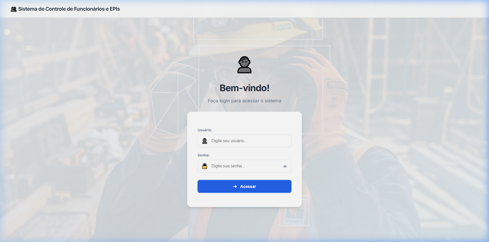
*Formulário de autenticação com animação de entrada suave (slide-up fade) e botão com pulso brilhante.*

#### 2. Painel de Controle (Dashboard)
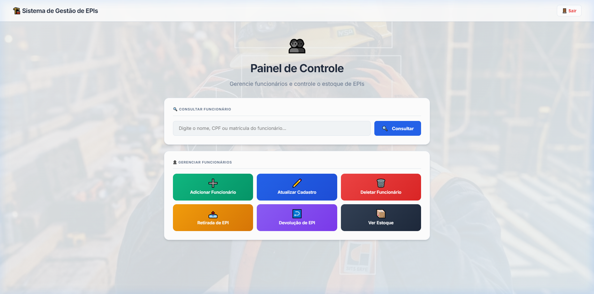
*Menu principal organizado em grid com ações coloridas por gradiente, cada uma com efeito hover e busca rápida.*

#### 3. Cadastro de Funcionário
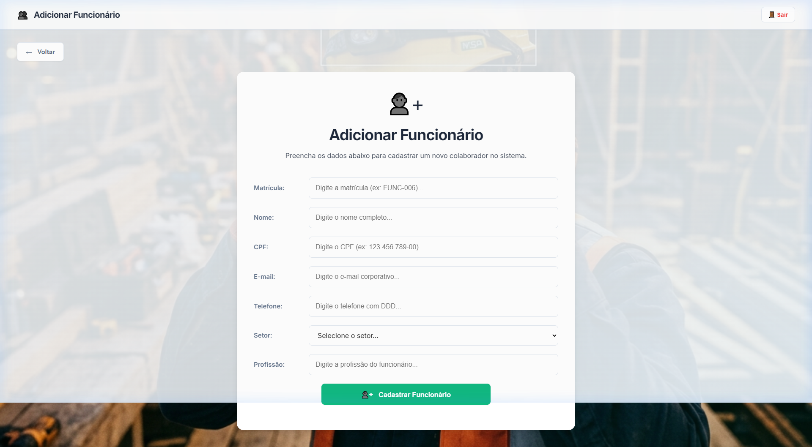
*Formulário de adição de colaboradores com campo livre para profissão, seleção de setor e validação visual.*

#### 4. Atualização e Reativação de Cadastro
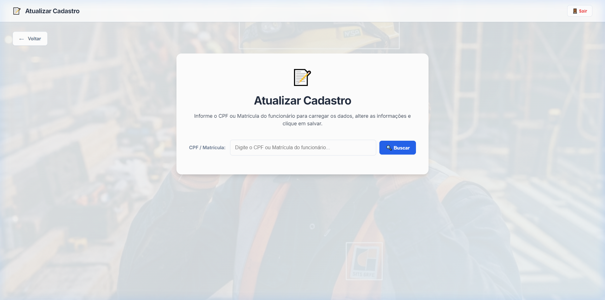
*Busca por CPF/Matrícula para alteração de dados do colaborador ou reativação de registros inativos.*

#### 5. Estoque de EPIs
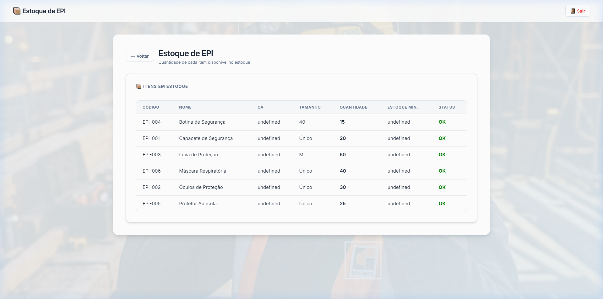
*Tabela de inventário em tempo real exibindo quantidade, estoque mínimo e status de cada EPI.*

#### 6. Retirada de EPI
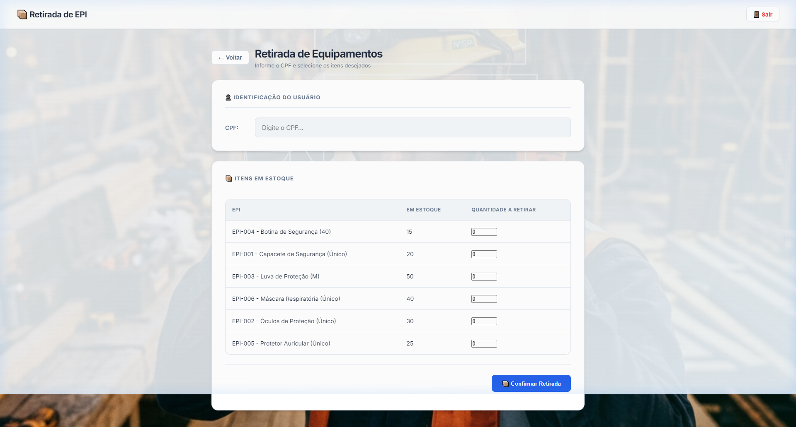
*Registro de entrega de EPIs por CPF, com seleção dinâmica dos itens disponíveis em estoque.*

#### 7. Devolução de EPI
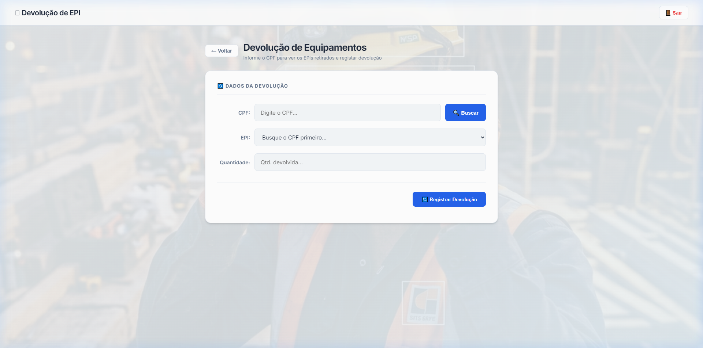
*Histórico de retiradas pendentes buscado pelo CPF, com controle de status (RETIRADO → DEVOLVIDO).*

#### 8. Inativação / Exclusão de Funcionário
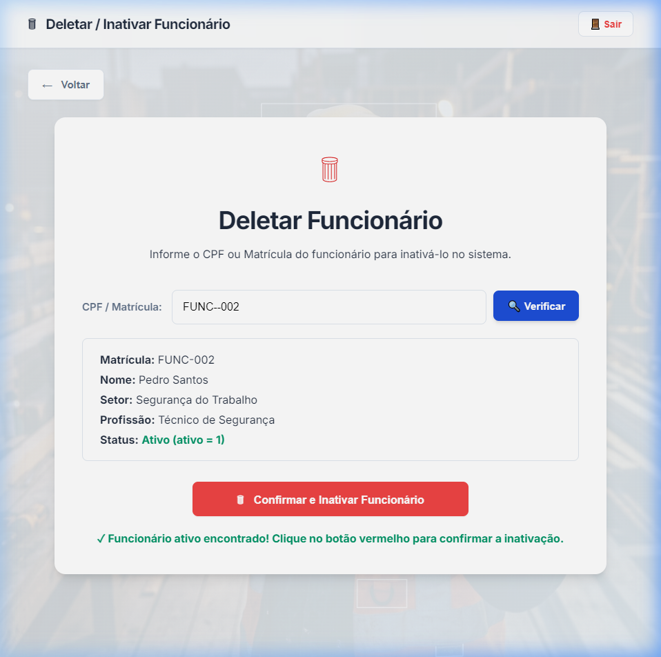
*Validação visual e confirmação de inativação lógica (soft delete) do colaborador por CPF ou Matrícula.*

---

### 7.2 Evidências de Consultas no Banco de Dados (DBA - SQL)

Abaixo estão os comprovantes de execução das consultas SQL no Banco de Dados MySQL para verificação da integridade das tabelas e relacionamentos:

#### 1. Consulta à Tabela de Funcionários (`SELECT * FROM funcionarios`)
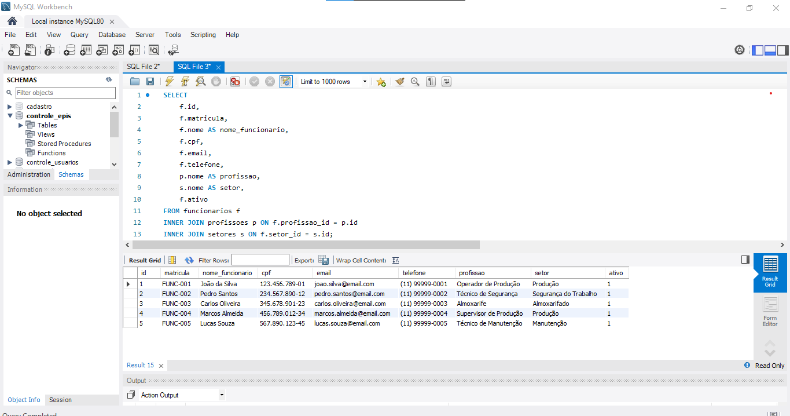
*Execução de consulta relacional trazendo a listagem de colaboradores cadastrados.*

#### 2. Consulta à Tabela de EPIs (`SELECT * FROM epis`)
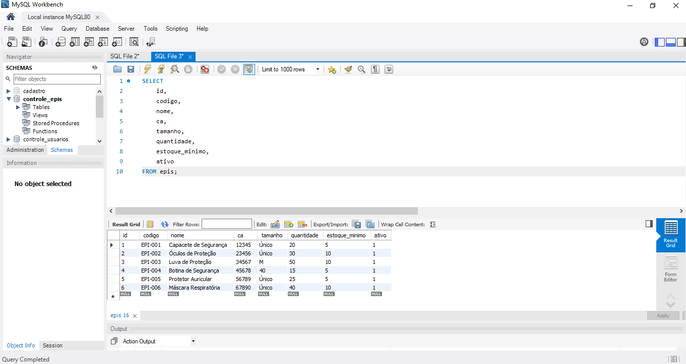
*Consulta ao inventário e controle de estoque de Equipamentos de Proteção Individual.*

#### 3. Registros de Retiradas (`SELECT * FROM retiradas`)
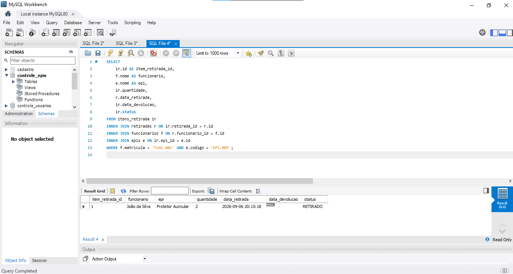
*Listagem de movimentações de entrega de EPIs vinculadas aos colaboradores.*

#### 4. Controle e Atualização de Devoluções de EPIs
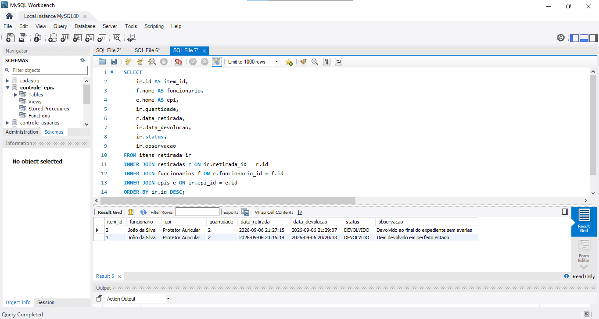
*Verificação dos itens com controle de status de devolução e reposição ao estoque.*

---

## Observação importante — erro no login do administrador

Se a instalação estiver funcionando, mas o login do administrador não estiver sendo aceito, verifique o arquivo `backend/config.py` e a configuração `MYSQL_PASSWORD = os.getenv("MYSQL_PASSWORD")`. Confira se a senha do seu MySQL está sendo carregada corretamente. Caso não esteja, insira manualmente no `config.py`, por exemplo:

```python
MYSQL_PASSWORD = "SUA_SENHA_DO_MYSQL"
```

Depois, salve o arquivo, encerre o servidor com `Ctrl + C` e execute novamente:

```cmd
python backend\servidor.py
```

